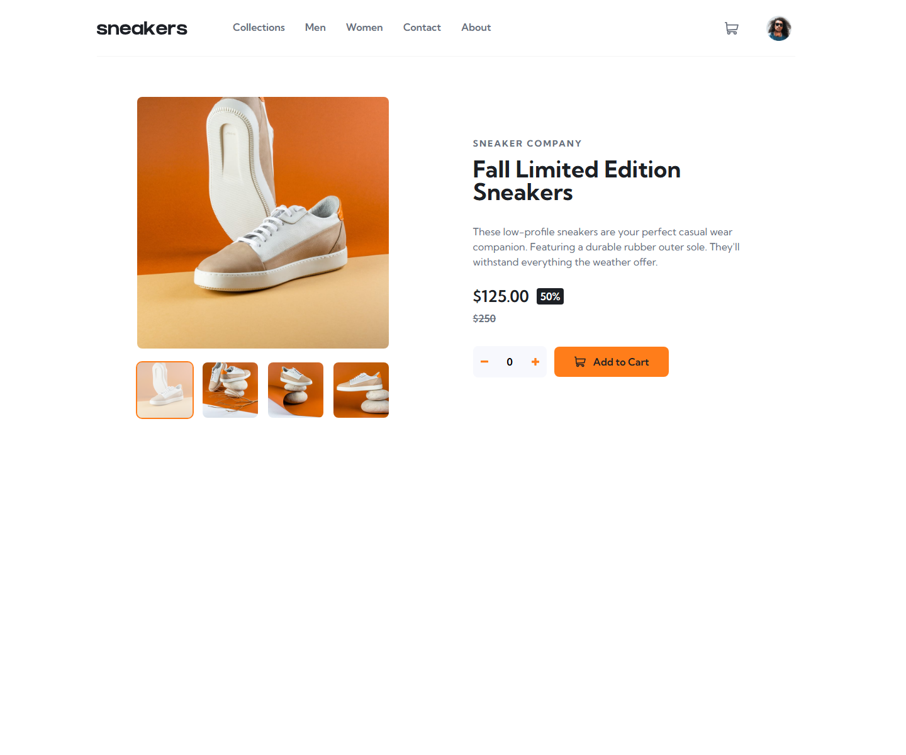

# Frontend Mentor - E-commerce Product Page Solution

This is my solution to the [E-commerce product page challenge on Frontend Mentor](https://www.frontendmentor.io/challenges/ecommerce-product-page-UPsZ9MJp6).

The goal of this challenge was to build a responsive product page with an image gallery, lightbox, cart dropdown, quantity controls, and interactive cart behavior using HTML, CSS, and vanilla JavaScript.

## Overview

## Screenshot



Users can:

- View responsive desktop and mobile layouts
- Switch product images using thumbnail buttons
- Open a desktop lightbox gallery
- Navigate product images with previous and next controls
- Use mobile image controls
- Increase and decrease product quantity
- Add the product to the cart
- View the cart item count
- Open and close the cart panel
- Remove the item from the cart

## Built With

- Semantic HTML5
- CSS custom properties
- Flexbox
- CSS Grid
- Responsive media queries
- Vanilla JavaScript
- JavaScript state management for gallery and cart behavior

## What I Learned

### JavaScript State Management

One of the biggest lessons was learning to avoid using the DOM as the main source of truth.

For the product gallery, I used:

```js
let activeImageId = 1;
```

The active image is stored in JavaScript state. Then the UI is updated from that state using one central function:

```js
setActiveImage(imageId);
```

This helped simplify thumbnail clicks, previous/next buttons, lightbox syncing, and active thumbnail styling.

### Rendering UI From Data

The product thumbnails are generated from a `productImages` array instead of being duplicated in the HTML.

This helped me understand the pattern:

```txt
data -> render HTML -> handle events -> update state -> re-render UI
```

The cart also follows this idea. Cart data is stored in an array, then the cart panel and cart counter are rendered from that data.

### Event Delegation

Some elements, such as thumbnail buttons and cart remove buttons, are created with JavaScript. Because they do not exist when the page first loads, I learned to listen for events on a parent element and use:

```js
event.target.closest(...)
```

This made the cart remove button work even though it is generated later.

### CSS Layout And Responsive Design

I practiced using Flexbox and CSS Grid for different parts of the layout:

- Header alignment
- Product gallery layout
- Product information layout
- Cart item rows
- Mobile responsive sections

I also learned when to use `position: absolute` for UI elements like the cart panel, and how to keep it visually connected to the cart button.

### Transitions And Hidden Elements

I learned that CSS cannot animate from or to `display: none`.

For the cart panel animation, the pattern became:

```txt
open: remove hidden -> wait one frame -> add open class
close: remove open class -> wait for transition -> add hidden
```

This helped the cart panel animate smoothly while still using the `hidden` attribute.

### Accessibility Basics

I added several accessibility improvements:

- Real buttons for interactive controls
- `aria-label` for icon-only buttons
- Empty `alt=""` for decorative icons
- `aria-expanded` for the cart and mobile menu
- A live region for cart status updates
- Keyboard support for the lightbox
- Focus management for the lightbox
- Reduced-motion support in CSS

This project helped me understand that accessibility is not one single feature. It is a collection of small decisions that make the interface easier to use.

## Continued Development

Areas I want to keep improving:

- Writing cleaner JavaScript modules as projects grow
- Improving focus management for menus, dialogs, and popovers
- Practicing more accessible UI patterns
- Reducing repeated CSS and improving design-system thinking
- Testing projects more thoroughly with keyboard navigation and screen readers

## Useful Resources

- [Frontend Mentor](https://www.frontendmentor.io/) - The challenge platform and design assets
- [MDN Web Docs](https://developer.mozilla.org/) - Reference for HTML, CSS, JavaScript, and accessibility concepts
- [The A11Y Project](https://www.a11yproject.com/) - Beginner-friendly accessibility guidance

## AI Collaboration

I used Codex as a learning assistant during this project. The goal was not just to get code written, but to understand better frontend patterns.

Codex helped with:

- Reviewing JavaScript logic
- Explaining state management
- Refactoring gallery and cart behavior
- Debugging CSS positioning and transitions
- Reviewing accessibility improvements
- Explaining trade-offs in beginner-friendly language

## Author

- Frontend Mentor - Add your Frontend Mentor profile link here
